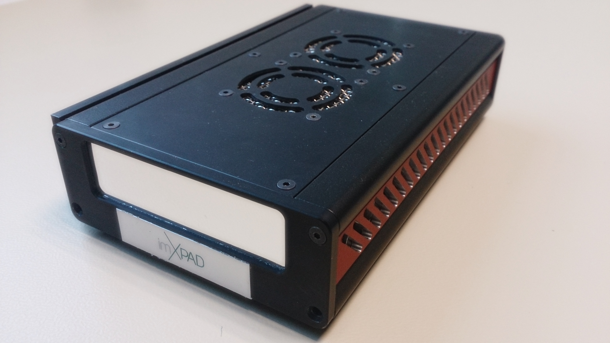

.. _camera-imxpad:

imXPAD camera plugin
--------------------



Introduction
````````````

The imXpad detectors benefit of hybrid pixel technology, which leads to major advantages compared to the other technologies. These advantages are mainly provided by direct photon conversion and real time electronic analysis of X-ray photons. This allows for direct photon counting and energy selection. 

XPAD detectors key features compared to CCDs and CMOS pixels detectors are: 
- Noise suppression
- Energy selection
- Almost infinite dynamic range
- High Quantum Efficiency (DQE(0) ~100%, dose reduction)
- Ultra fast electronic shutter (10 ns)
- Frame rate > 500 Hz

Prerequisite
````````````
In order to operate the imXpad detector, the USB-server or the PCI-server must be running in the computer attached to the detector.

Installation & Module configuration
````````````````````````````````````
-  follow first the steps for the linux installation :ref:`linux_installation`

The minimum configuration file is *config.inc*:

.. code-block:: sh

  COMPILE_CORE=1
  COMPILE_SIMULATOR=0
  COMPILE_SPS_IMAGE=1
  COMPILE_IMXPAD=1
  COMPILE_CONFIG=1
  COMPILE_GLDISPLAY=0
  LINK_STRICT_VERSION=0
  export COMPILE_CORE COMPILE_SPS_IMAGE COMPILE_SIMULATOR \       
       COMPILE_IMXPAD \
       COMPILE_GLDISPLAY \
       LINK_STRICT_VERSION
    
-  start the compilation :ref:`linux_compilation`

-  finally for the Tango server installation :ref:`tango_installation`

Initialisation and Capabilities
````````````````````````````````

Camera initialisation
......................


imXpad camera must be initialisated using 3 parameters:
	1) The IP adress where the USB or PCI server is running
	2) The port number use by the server to communicate.
	3) The detector model.
	
Std capabilites
................

* HwDetInfo

  getCurrImageType/getDefImageType():

* HwSync: 

  get/setTrigMode(): the only supported mode are IntTrig, ExtTrigSingle, ExtGate.

Refer to: http://80.15.49.71/manuals.html for a whole description of detector capabilities.

Optional capabilites
.....................

This plugin does not use optional hardware capabilities.

How to use
````````````
This is a python code example for a simple test:

.. code-block:: python

  from Lima import imXpad
  from Lima import Core

  cam = imXpad.Camera('10.211.55.2', 3456, 'XPAD_S70')
  HWI = imXpad.Interface(cam)
  CT = Core.CtControl(HWI)
  CTa = CT.acquisition()
  CTs = CT.saving()
  CTs.setDirectory("/home/imxpad/data")
  CTs.setPrefix("20140515_01_")
  CTs.setFormat(CTs.EDF)
  CTs.setSuffix(".edf")
  CTs.setSavingMode(CTs.AutoFrame)
  CTa.setAcqExpoTime(1)
  CTa.setAcqNbFrames(5)
  cam.init()

  CT.prepareAcq()
  CT.startAcq()
  cam.stopAcq()
  cam.exit()
